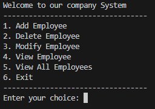

# Employee Record Management System

A dynamic, command-line based Employee Record Management System written in C. 

Unlike basic array-based systems, this project implements a **Singly Linked List** data structure. This allows for dynamic memory allocation (`malloc` / `free`), meaning the system can handle an arbitrary number of employees efficiently. It also features modular architecture and timestamp tracking.

## 🚀 Features

* **Dynamic Storage:** Uses linked lists to store employee records efficiently without hardcoded limits.
* **Add Employee:** Captures Full Name, Age, Salary, Title, and ID. Automatically generates a timestamp (`time_t`) of exactly when the employee was added.
* **Modify Employee:** Search for an employee by their unique ID and update their details.
* **Delete Employee:** Safely removes an employee node from the linked list by ID, re-linking the list and freeing memory to prevent leaks.
* **View Operations:** Search for a specific employee by Name, or view all existing employees in the system.
* **Memory Management:** Safely frees all allocated memory upon exiting the application.

  

## 📂 Project Structure

```text
EMPLOYEERECORDSYSTEM/
├── bin/          # Compiled executables
└── src/          # Source code
    ├── employee.c  (Core logic and linked list operations)
    ├── employee.h  (Struct definitions and prototypes)
    └── main.c      (User interface and menu loop)
```
## 🛠️ How to Compile and Run

To run this project locally, you will need a C compiler (like GCC) installed on your system.

**1. Clone the repository:**
```bash
git clone https://github.com/mohamedGhareeb20/Employee_Record_System.git
cd Employee_Record_System
```
**2. Compile the code:**
```bash
gcc src/main.c src/employee.c -o bin/employee_app
```
**Run the application:**
```bash
.\bin\employee_app.exe
```

